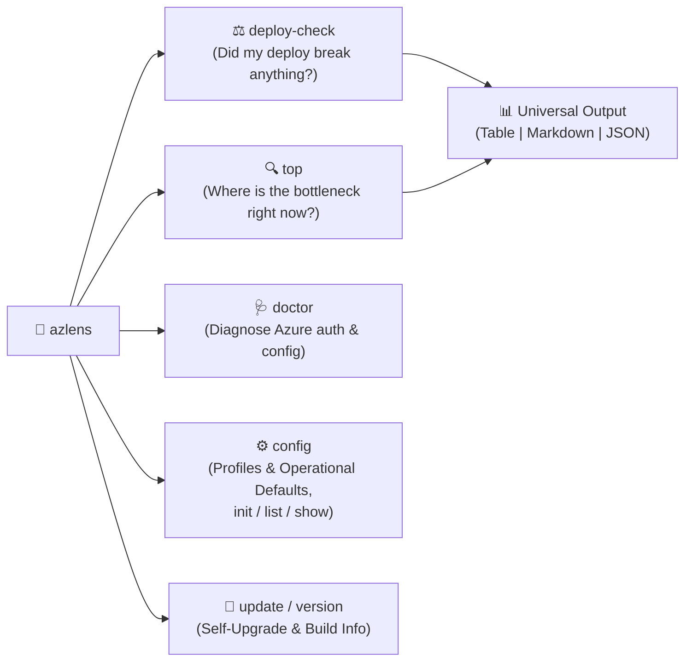

# 🚀 AzLens

**AzLens** is a high-performance, single-binary **Go CLI tool** designed for Azure engineers, developers, and SREs to detect performance regressions, inspect latency bottlenecks, and interrogate telemetry from **Azure Monitor, Application Insights, and Log Analytics**.

---

## ⚡ Quick Install

Install the latest release directly to your `PATH` with a single command:

```bash
curl -sSL https://raw.githubusercontent.com/denjamio/azlens/main/install.sh | bash
```

Or build locally with Docker (zero host dependencies required):
```bash
make build
```

---

## 🧠 Mental Model & Core Flow

AzLens is built around **two primary operational workflows**:



1. **`azlens deploy-check`** (*Post-Deploy Regression Quality Gate*): Compare pre- vs post-deploy telemetry (latency percentiles $P_{50}, P_{75}, P_{90}, P_{95}, P_{99}$, error rates, N+1 SQL queries, new unindexed database calls, and newly introduced exceptions).
2. **`azlens top [endpoints|queries|n-plus-one|breakdown|errors|deprecations]`** (*Live Triage Snapshot*): Instantly surface the slowest API endpoints, heavy database queries, error signatures, or framework deprecation warnings.
3. **`azlens doctor`** (*Environment Diagnostics*): Verify Azure CLI installation, active login status, and profile configuration validity.
4. **`azlens config [list|show|init]`** (*Profile & Defaults Manager*): Inspect configured environments and generate starter configuration files.

---

## 📋 Production Commands & Usage

### 1. Pre- vs Post-Deploy Regressions (`azlens deploy-check`)
Compare metrics between two time windows to automatically detect latency regressions, N+1 SQL queries, new unindexed queries, and error spikes:

```bash
# Direct positional duration: compare last 1h vs previous 1h
azlens deploy-check 1h

# Check the last 30 minutes vs previous 30 minutes
azlens deploy-check 30m

# Target a specific profile and output as Markdown (ideal for GitHub/GitLab PR comments)
azlens deploy-check 30m -p prod -o markdown

# Offline demo mode (no Azure connection needed)
azlens deploy-check --mock
```

**CI Quality Gate:** `deploy-check` is pipeline-aware through exit codes — `0` when no critical regressions are detected, `1` on error, and `2` when critical regressions are found (after the report is printed). Example GitHub Actions step:

```yaml
- name: Deploy regression quality gate
  run: azlens deploy-check 30m -p prod -o markdown | tee deploy-report.md
```

**Terminal Output Preview:**
```text
═══════════════════════════════════════════════════════════════════════
 🚀 AZLENS DEPLOY REGRESSION REPORT: Production Microservices
═══════════════════════════════════════════════════════════════════════
 Baseline Window: 20:00 to 21:00 | Post-Deploy Window: 21:00 to 22:00
 Overall Status:  ✅ HEALTHY (No significant regressions detected)

+----------------+--------------+--------------+-------------------+--------+
|     METRIC     |   BASELINE   | POST-DEPLOY  |       DELTA       | STATUS |
+----------------+--------------+--------------+-------------------+--------+
| P50 Latency    | 52.00ms      | 54.20ms      | +2.20ms (+4.2%)   | OK     |
| P95 Latency    | 295.00ms     | 302.10ms     | +7.10ms (+2.4%)   | OK     |
| P99 Latency    | 580.00ms     | 595.00ms     | +15.00ms (+2.6%)  | OK     |
| Error Rate     | 1.25%        | 1.28%        | +0.03% (+0.0%)    | OK     |
| Total Requests | 48100.00reqs | 49350.00reqs | +1250reqs (+2.6%) | OK     |
+----------------+--------------+--------------+-------------------+--------+

📌 Per-Endpoint Latency & Error Rate Diff:
+------------------------------+----------+----------+--------+-----------+-----------+--------+
|           ENDPOINT           | BASE P95 | POST P95 | P95 Δ% | BASE ERR% | POST ERR% | STATUS |
+------------------------------+----------+----------+--------+-----------+-----------+--------+
| POST /api/v1/orders/checkout | 820.0ms  | 825.0ms  | +0.6%  | 4.10%     | 4.15%     | OK     |
| GET /api/v1/catalog/search   | 165.0ms  | 168.0ms  | +1.8%  | 0.18%     | 0.18%     | OK     |
| GET /api/v1/users/{id}       | 72.0ms   | 73.5ms   | +2.1%  | 0.05%     | 0.05%     | OK     |
+------------------------------+----------+----------+--------+-----------+-----------+--------+
```

---

### 2. Live System Triage (`azlens top`)
Inspect current latency bottlenecks, N+1 queries, latency breakdown, and errors:

```bash
# Slowest API endpoints ordered by P95 latency (positional duration or default 1h)
azlens top endpoints 30m -n 10
azlens top endpoints

# Detect N+1 queries across endpoints
azlens top n-plus-one 1h
azlens top n-plus-one 1h -o markdown

# Break down where time is spent (% Database, % External APIs, % Cache, % App Code)
azlens top breakdown 2h
azlens top breakdown -o markdown

# Slow database queries (SQL, Redis, Cosmos DB) & remote HTTP dependencies
azlens top queries 2h --type SQL
azlens top queries --type all -o markdown

# Deep dive into true Database Engine slow queries (MySQL MySqlSlowLogs in Log Analytics)
azlens top slow-logs 2h
azlens top slow-logs 2h --slowest -o markdown

# Grouped exceptions and HTTP 5xx errors
azlens top errors 1h

# Framework and library deprecation warnings (for runtime & library upgrades)
azlens top deprecations 24h
azlens top deprecations -o markdown
```

**Latency Breakdown Preview (`azlens top breakdown`):**
```text
+------------------------------+-----------+------------+------------+---------+------------+
|           ENDPOINT           | AVG TOTAL | % DATABASE | % EXT APIS | % CACHE | % APP CODE |
+------------------------------+-----------+------------+------------+---------+------------+
| POST /api/v1/orders/checkout | 480.0ms   | 12.5%      | 78.5%      | 2.0%    | 7.0%       |
| GET /api/v1/orders           | 320.0ms   | 82.0%      | 0.0%       | 4.5%    | 13.5%      |
| GET /api/v1/catalog/search   | 85.0ms    | 25.0%      | 0.0%       | 65.0%   | 10.0%      |
+------------------------------+-----------+------------+------------+---------+------------+
```

---

## ⏱️ Default Timeframes (Convention over Configuration)

AzLens uses sensible defaults out of the box:

| Command | Default Time Window | Override (Positional) |
| :--- | :--- | :--- |
| **`azlens top`** (`endpoints`, `queries`, `n-plus-one`, `breakdown`, `errors`, `deprecations`) | **Last 1h** (`now - 1h .. now`) | `[duration]` (e.g. `30m`, `2h`) |
| **`azlens deploy-check`** (Pre vs Post Deploy) | **Post:** Last 1h (`1h..now`)<br>**Baseline:** Previous 1h (`2h..1h`) | `[duration]` (e.g. `30m`, `2h`) |

---

## ⚙️ Configuration & Project Scoping (`azlens.yaml`)

Following **Convention over Configuration**, the config file is the **single source of truth**: Azure targets, subscriptions, scopes, thresholds, and operational defaults all live in `azlens.yaml`. The CLI surface stays minimal (`-p` to switch profiles, `-o` to change output format, positional durations, and `-c` to point at an explicit config file — which must exist, there is no silent fallback).

Following the same principle, AzLens works out of the box even without any configuration file (using built-in defaults).

To configure project-specific scopes, Azure IDs, and operational defaults, create **`azlens.yaml`** in your project root (clear naming, no leading dot — meant to be **committed** and shared by the team):

```bash
azlens config init
```

### Configuration Structure (`version`, `defaults`, `shared`, `profiles`)

Declare **once** in `shared` everything that does **not** vary across environments; each profile only declares what differs (typically `insights.name` and `logs.workspace_id`). Any shared field can be overridden per profile when needed.

```yaml
version: "1.0"

# Operational defaults (inherited by all profiles)
defaults:
  profile: prod          # Active default profile (override with --profile / -p)
  window: "1h"           # Default timeframe for 'azlens top' (override with positional arg)
  since: "1h"            # Default comparison duration for 'azlens deploy-check' (override with positional arg)
  limit: 15              # Default number of rows returned in tables (override with --limit / -n)
  output: "table"        # Output format: table | markdown | json (override with --output / -o)

# Shared target: set once, inherited by every profile
shared:
  insights:
    subscription: "11111111-aaaa-bbbb-cccc-111111111111" # App Insights subscription (same for all environments)
  logs:
    subscription: "22222222-dddd-eeee-ffff-222222222222" # Log Analytics subscription (same for all environments)
    namespace: "ecommerce"         # Kubernetes namespace
    database: "backend_ror"        # Database name for slow query logs (MySqlSlowLogs)
  roles: ""                      # cloud_RoleName(s): EXACT microservice names — scalar or list (empty = all services)
  pods: ""                       # Pod names WITHOUT the deployment hash, token-matched — scalar or list (empty = all pods)
  exclude_synthetic: true
  exclude_probes: true

# Environment targets: only what differs per environment
profiles:
  prod:
    name: "Production Microservices"
    target:
      insights:
        name: "app-shared-prod"  # Resource name from the portal URL (or App ID GUID)
      logs:
        workspace_id: "33333333-hhhh-iiii-jjjj-333333333333" # Log Analytics workspace Customer ID GUID

    # Quality gate thresholds (optional, defaults: 15% warn / 30% crit, 5 min samples)
    thresholds:
      p95_latency_warn_pct: 15.0
      p95_latency_crit_pct: 30.0
      error_rate_warn_delta: 1.0
      error_rate_crit_delta: 3.0
      min_sample_calls: 5        # Ignore noise on endpoints with fewer calls than this

  staging:
    name: "Staging Environment"
    target:
      insights:
        name: "app-shared-staging"
      logs:
        workspace_id: "44444444-aaaa-bbbb-cccc-444444444444"
      # Optional per-environment overrides of any shared field:
      # roles: billing-service
    defaults:
      window: "30m"
      since: "15m"
    thresholds:
      p95_latency_warn_pct: 25.0
      p95_latency_crit_pct: 50.0
      error_rate_warn_delta: 2.0
      error_rate_crit_delta: 5.0
      min_sample_calls: 5

  dev:
    name: "Development Environment"
    target:
      insights:
        name: "app-shared-dev"
      logs:
        workspace_id: "55555555-eeee-ffff-dddd-555555555555"
```

> **Note:** `target.insights.name` accepts the App Insights resource name (as seen in the portal URL) or its App ID GUID, but `target.logs.workspace_id` requires the Log Analytics workspace **Customer ID (GUID)** — the "Workspace ID" shown in Portal → Log Analytics workspace → Overview. Retrieve it with `az monitor log-analytics workspace show -g <rg> -n <name> --query customerId -o tsv`.

### Target Filters — What Each Option Actually Filters

| Option | KQL column filtered | Applies to |
| :--- | :--- | :--- |
| `roles` | `cloud_RoleName` — **exact** microservice names, scalar or list (single: `=~`, multiple: `in~`) | App Insights: requests, dependencies, exceptions, traces |
| `pods` | `cloud_RoleInstance` — token match on the pod name **without** the deployment hash, scalar or list (single: `has`, multiple: `has_any`) | App Insights + container logs |
| `logs.namespace` | `customDimensions['Kubernetes.Namespace']` / `PodNamespace` | Log Analytics (+ App Insights customDimensions) |
| `logs.database` | `Db` / `DatabaseName_s` | `MySqlSlowLogs` (Log Analytics) |
| `resource_id` | `_ResourceId` | Log Analytics multi-resource workspaces |
| `exclude_synthetic` | `operation_SyntheticSource` / `syntheticSource` | App Insights (availability tests) |
| `exclude_probes` | `kube-probe` User-Agent + `/healthz`-style routes | App Insights |
| `custom_dimensions` | `customDimensions['<key>'] =~ '<value>'` | App Insights |

Without `roles`, queries scan telemetry from **all** microservices reporting to the App Insights resource — azlens warns about this at startup.

Both YAML forms are equivalent — scalar or list:

```yaml
shared:
  roles: order-service                     # single microservice (exact name)
  # or
  roles: [order-service, billing-service]  # several microservices
  pods: order-service                      # matches order-service-7c9d, order-service-8f2e, ... (no hash needed)
```

Filter by one of the configured roles/pods — or any other — for a single run without editing the config: `--role` / `--pod` **replace** the configured list for that run (repeatable or comma-separated):

```bash
# Only ONE of the several configured roles
azlens top endpoints 1h --role billing-service

# Only ONE pod (or a specific one)
azlens top endpoints 1h --pod order-service

# Several at once
azlens top endpoints 1h --role order-service,billing-service
azlens top errors 24h --role order-service --role billing-service

# Compare deploy health for a single microservice
azlens deploy-check 4h --role order-service
```

### Profile Management Commands
```bash
# List all configured profiles and see which one is active
azlens config list

# Show active profile configuration details
azlens config show

# Override the profile on the fly for any single command
azlens top endpoints -p staging
azlens deploy-check -p staging
```

### Environment & Authentication Diagnostics (`azlens doctor`)
```bash
# Verify Azure CLI installation, extensions (application-insights, log-analytics),
# login session, and validate the active profile configuration
azlens doctor
```

---

## 🔄 Self-Update

Keep `azlens` up to date with the built-in update command:

```bash
# Check for updates and automatically upgrade the binary in-place
azlens update

# Only check if a new version is available
azlens update --check

# Check current installed version
azlens version
```

---

## 🔐 Required Azure Permissions (RBAC)

AzLens runs read-only telemetry queries through the authenticated Azure CLI (`az`), so the signed-in identity (user or service principal) needs **Reader-class roles** — no write permissions are ever requested:

| Target | Required Role | Scope |
| :--- | :--- | :--- |
| Application Insights | **Monitoring Reader** | The App Insights resource (or its resource group) |
| Log Analytics workspace | **Log Analytics Reader** | The workspace resource (or its resource group) |

### Subscription Sessions & Multi-Directory Logins

There is no `tenant` config: the **subscription determines the directory (tenant)** of each query — `az` resolves it among the sessions you have authenticated. azlens never stores or refreshes tokens; session management stays entirely inside the az CLI.

What azlens does manage for you:

- **Pre-flight on every `top` / `deploy-check`**: verifies that each subscription configured in the profile (`insights.subscription`, `logs.subscription`) is available in the current az session.
- **Interactive login on demand**: on a terminal, if a subscription is missing from the session, azlens launches `az login` for you (pick the account/directory that owns it) and re-verifies before querying.
- **CI / non-interactive runs**: never hangs on a login prompt — it fails fast with `subscription(s) not in the active az session: <id>` and a hint to run `az login --tenant <tenant-id>`.
- **`azlens doctor`**: reports per-subscription session coverage (✓ / ✗) for the active profile.

For cross-directory setups (App Insights in directory A, Log Analytics in directory B), the one-time setup is just:

```bash
az login --tenant <directory-A>   # hosts App Insights
az login --tenant <directory-B>   # hosts Log Analytics
```

After that, each query is routed statelessly with its own `--subscription`; no account switching ever happens.

Grant access with:

```bash
az role assignment create --assignee <user-or-sp> --role "Monitoring Reader" --scope <app-insights-resource-id>
az role assignment create --assignee <user-or-sp> --role "Log Analytics Reader" --scope <workspace-resource-id>
```

> **Note on query cost:** AzLens queries scan the Log Analytics / App Insights tables you point them at. Large time windows (e.g. `deploy-check 24h`) and workspaces on pay-as-you-go plans incur real query costs; prefer the smallest window that answers your question.

---

## 🧯 Troubleshooting

| Symptom | Likely Cause | Fix |
| :--- | :--- | :--- |
| `'log-analytics' is mispelled or not recognized by the system` (same for `app-insights`) | The az CLI **extension** providing the query command is not installed | `az extension add --name log-analytics` and/or `az extension add --name application-insights` (azlens pre-flight and `doctor` detect this and print the same hint) |
| `azure authentication failed: session expired or not logged in` | `az` session expired or wrong tenant | `az login` (add `--tenant <tenant-id>` for cross-directory setups) |
| `subscription(s) not in the active az session: <id>` | A configured subscription belongs to a directory you have not authenticated | On a terminal azlens launches `az login` automatically; otherwise run `az login --tenant <tenant-id>` for the directory hosting that subscription |
| `azure subscription not found in active account` | Target lives in another subscription/tenant | Set `target.insights.subscription` / `target.logs.subscription` in `azlens.yaml`; `az login --tenant` for the other directory |
| `azure resource not found` | Wrong `target.insights.name` or `target.logs.workspace_id` | `target.logs.workspace_id` must be the **Customer ID (GUID)**, not the workspace name; `target.insights.name` is the resource name (or App ID) |
| 403 / authorization errors on first run | Missing RBAC roles | See [Required Azure Permissions](#-required-azure-permissions-rbac) above |
| Empty tables for `top queries` | `--type` value not matching your dependency `type` | Use `SQL`, `HTTP`, `Redis`, `Cosmos`, or `all` (case-insensitive) |
| `MySqlSlowLogs` returns nothing | MySQL Flexible Server diagnostic settings not enabled | Enable the `MySqlSlowLogs` diagnostic category on the MySQL server; also set `target.database` to filter |
| Queries return telemetry from all microservices | `target.roles` not set | Set `cloud_RoleName` isolation via `target.roles` (AzLens warns about this at startup) |

---

## ⚡ High-Performance & Safe KQL Engine

1. **Batched KQL Requests & Fast-Fail**: `deploy-check` fetches a full window (overall, endpoints, dependencies, exceptions, fan-out) in a **single KQL request** — 2 `az` CLI invocations instead of 10 — with both windows running in parallel and instant fast-fail cancellation on error.
2. **Noise Cancellation & Smart Grouping**: Automatically filters out client aborts (`ClientClosedRequest`), bot 404 scans, and health probes. Normalizes dynamic IDs (`<ID>`, `<UUID>`) and line numbers (`:<line>`) so telemetry groups into true counts.
3. **Partition Pruning**: Time-range filters (`timestamp between ...`) are placed at the root of every subquery to prevent full table scans.
4. **Token-Indexed Search**: Uses KQL `has` / `has_any` to leverage Azure's inverted term indexes, performing up to 10x faster than full string scans.
5. **Multi-Percentile Efficiency**: Uses native KQL `percentiles(duration, 50, 75, 90, 95, 99)` for fast single-pass evaluation.
6. **Universal Formatting**: First-class support for Terminal Tables with smart truncation, GitHub/GitLab Markdown, and raw JSON across every single command.
7. **Strict Parameter Sanitization**: Enforces safe KQL identifier sanitization to guarantee query safety.

