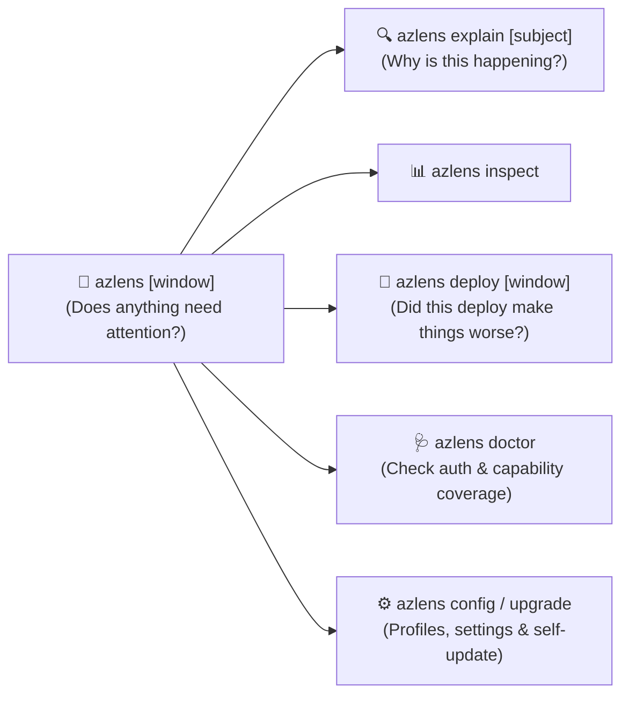

# 🚀 AzLens

> **Does this environment need my attention right now?**

**AzLens** is a simple, opinionated, actionable operational CLI for Azure environments.

AzLens is not a terminal dashboard and does not dump raw telemetry by default. It interrogates **Azure Monitor, Application Insights, and Log Analytics**, interprets the signals, and returns:

$$\text{problem} \rightarrow \text{impact} \rightarrow \text{likely cause} \rightarrow \text{evidence} \rightarrow \text{next action}$$

---

## ⚡ Quick Install

Install the latest release directly to your `PATH`:

```bash
curl -sSL https://raw.githubusercontent.com/denjamio/azlens/main/install.sh | bash
```

Or build locally with Docker (zero host dependencies required):
```bash
make build
```

---

## 🧠 Core Principles

1. **One problem, one story**: Multiple related symptoms collapse into a single operational problem whenever they describe the same user-visible degradation (e.g. an endpoint latency regression caused by a failing downstream dependency is reported as one story, not five disjoint alerts).
2. **Silence is a feature**: If nothing needs attention, AzLens gets out of your way with a concise, clean confirmation (`Everything looks normal.`).
3. **No magic scores**: There is no arbitrary health percentage or metric soup. Environments are strictly **`healthy`**, **`degraded`**, or **`unknown`**.
4. **Actionability over raw data**: Every finding provides an immediate, copy-pasteable next step command.



---

## 📋 Command Reference

### 1. Primary Operational Command (`azlens [window]`)

Evaluate current operational health across all configured capabilities:

```bash
# Check current operational status over default window (last 1h)
azlens

# Inspect last 30 minutes or 2 hours
azlens 30m
azlens 2h

# Target a specific environment profile
azlens -p prod
azlens -p staging

# Machine-readable output (JSON schema v1 or Markdown)
azlens -o json
azlens -o markdown
```

**Healthy Output (Silence is a feature):**
```text
Production · last 60m

Everything looks normal.
```

**Degraded Output (Actionable problem story):**
```text
Production · last 60m

Needs Attention:
[1] POST /api/v1/orders/checkout degraded by api.stripe.com failures
    Impact:       p95 latency increased by 140% (380ms -> 912ms); 4.2% error rate
    Likely cause: HTTP dependency 'api.stripe.com' error rate increased to 5.8% (+5.7pp)
    Evidence:
      • POST /api/v1/orders/checkout p95 latency: 912ms (baseline 380ms, +140%)
      • api.stripe.com dependency errors: 5.8% (baseline 0.1%, +5.7pp)
    Next action:
      -> azlens explain api.stripe.com

Worth Watching:
[1] NoMethodError in /api/v1/user/settings (12 occurrences)
    Impact:       Negligible (< 0.05% of request volume)
    Next action:
      -> azlens explain NoMethodError
```

---

### 2. Root Cause Analysis (`azlens explain [subject] [window]`)

Explain why an operational problem is happening and show deep supporting evidence:

```bash
# Explain the highest-priority operational problem
azlens explain

# Explain a specific service, endpoint, dependency, or exception
azlens explain checkout
azlens explain api.stripe.com
azlens explain NpgsqlException 2h
```

**Deterministic Ambiguity Protection:**
If a query subject matches multiple components (e.g. `order`), AzLens does not guess:
```text
"order" matches:

  POST /orders/checkout (endpoint)
  sqldb-orders (dependency)

Be more specific.
```

---

### 3. Direct Telemetry Inspection (`azlens inspect <view> [window]`)

Drill down into inspectable operational evidence, ordered by operational impact:

```bash
# Slowest API endpoints ordered by P95 latency and error rates
azlens inspect endpoints 30m -n 10

# Slow database queries and external HTTP/Redis dependencies
azlens inspect dependencies 1h --type SQL
azlens inspect dependencies 1h --type all

# Database engine slow query logs (MySqlSlowLogs in Log Analytics)
azlens inspect queries 2h

# Grouped application exceptions and HTTP 5xx errors
azlens inspect errors 1h

# Kubernetes container workloads, crash loops, and OOM kills
azlens inspect runtime
```

---

### 4. Post-Deploy Regression Verifier (`azlens deploy [window] [--at TIME]`)

Compare telemetry between two equal time windows (before vs after release) to verify deployment safety:

```bash
# Compare the last 30 minutes vs the 30 minutes before
azlens deploy 30m

# Center comparison on a deployment timestamp
azlens deploy 30m --at 14:30
azlens deploy 30m --at -20m

# Target production profile and output as Markdown for PR / CI
azlens deploy 30m -p prod -o markdown
```

**Clean Verdicts:**
- Healthy: `This deploy looks safe.`
- Regressed: `This deploy made POST /orders/checkout worse.` (only changed signals are shown!)
- Insufficient data: `Insufficient baseline data to verify safety.`

---

### 5. Diagnostics & Coverage (`azlens doctor`)

Verify Azure CLI installation, authentication, and inspect the 8 operational capabilities:

```bash
azlens doctor
```

Reports status across all 8 capabilities:
- `requests` (App Insights / Container App requests)
- `dependencies` (SQL, Redis, HTTP calls)
- `exceptions` (Application error signatures)
- `availability` (Synthetic availability tests)
- `kubernetes_workloads` (Replica counts, status)
- `kubernetes_events` (KubeEvents, pod restarts)
- `resource_saturation` (Container CPU and memory)
- `database_slow_logs` (MySQL slow query logs)

---

### 6. Supporting Commands

```bash
# Profile and configuration management
azlens config init       # Create starter azlens.yaml with prod, staging, and dev profiles
azlens config list       # List configured profiles and active profile
azlens config profiles   # Compact profile list
azlens config show       # Show active configuration (secrets redacted)
azlens config path       # Print path to active config file

# Self-upgrade
azlens upgrade           # Check and upgrade binary in-place to latest GitHub release
azlens upgrade --check   # Check if a new version is available without installing

# Version
azlens version           # Print build version, commit, and date
```

*(Note: `azlens update`, `azlens deploy-check`, and `azlens top` are retained as deprecated aliases for backward compatibility).*

---

## 🚦 Process Exit Codes

AzLens exit codes are pipeline-aware and designed for CI/CD gates:

| Exit Code | Meaning | Use Case |
| :---: | :--- | :--- |
| **`0`** | **Healthy / Safe** | Observed window has no actionable problems or deploy regressions. |
| **`1`** | **Failure / Error** | Configuration error, query execution failure, or invalid arguments. |
| **`2`** | **Actionable Problem / Regression** | Environment degraded or post-deploy regression detected. |
| **`3`** | **Insufficient Data / Unknown** | Telemetry missing, stale, or baseline insufficient to determine health. |

### Example GitHub Actions Workflow

```yaml
- name: Verify Deployment Health
  shell: bash
  run: |
    set -o pipefail
    azlens deploy 30m -p prod -o markdown | tee deploy-verdict.md
```

---

## ⚙️ Configuration & Profile Isolation (`azlens.yaml`)

AzLens follows **Convention over Configuration**. The config file is the single source of truth for environments:

```yaml
version: "1.0"

defaults:
  profile: prod          # Default active profile
  window: "1h"           # Default operational window
  limit: 15              # Table row limit
  output: "table"        # table | markdown | json

# Shared targets and thresholds
shared:
  thresholds:
    p95_latency_warn_pct: 15.0
    p95_latency_crit_pct: 30.0
    error_rate_warn_delta: 1.0
    error_rate_crit_delta: 3.0
    min_sample_calls: 5

profiles:
  prod:
    name: "Production"
    subscription_id: "11111111-aaaa-bbbb-cccc-111111111111"
    resource_group: "rg-prod"
    workspace_id: "33333333-hhhh-iiii-jjjj-333333333333"
    target:
      insights:
        name: "app-insights-prod"
      logs:
        namespace: "prod"
      roles:
        - checkout-service

  staging:
    name: "Staging"
    subscription_id: "22222222-dddd-eeee-ffff-222222222222"
    resource_group: "rg-staging"
    workspace_id: "44444444-aaaa-bbbb-cccc-444444444444"
    target:
      insights:
        name: "app-insights-staging"
      logs:
        namespace: "staging"
      roles:
        - checkout-service
```

### Profile Resolution Precedence
1. Explicit CLI flag: `--profile <name>` / `-p <name>`
2. Environment variable: `AZLENS_PROFILE`
3. Config defaults: `defaults.profile`
4. Single profile fallback: If exactly one profile exists in `azlens.yaml`
5. Fast error: Clear message with available profiles

---

## 🔐 Multi-Tenant & Multi-Subscription Azure Auth

AzLens integrates directly with the official Azure CLI (`az`):
- **Zero credential storage**: AzLens never stores tokens or passwords on disk.
- **Shared session (`~/.azure`)**: Automatically leverages existing terminal credentials.
- **Cross-tenant support**: Sets subscription context seamlessly via `az account set --subscription <id>`.
- **Interactive login**: Launches `az login --tenant <directory_id>` when sessions require re-authentication.

---

## ⚡ High-Performance KQL Engine

1. **Batched KQL Invocations**: Parallel single-request telemetry bundles minimize Azure CLI round trips.
2. **Noise Filtering**: Automatically drops client aborts (`ClientClosedRequest`), bot scans, and health probes.
3. **Partition Pruning**: Pushes time-range boundaries to root subqueries to avoid scanning full tables.
4. **Token Indexing**: Uses KQL `has` / `has_any` to exploit Azure's inverted term index.
5. **Strict Sanitization**: Neutralizes quote injection, escapes statement separators, and validates table whitelist.
